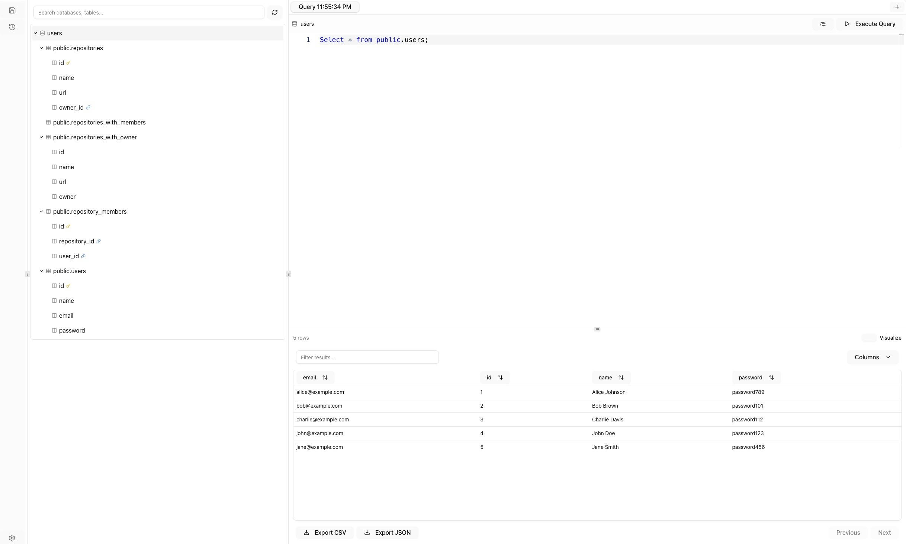

# r2-data2

r2-data2 is a web-based SQL query tool, data browser, and visualization platform built with a Rust (Axum) backend and a React (TypeScript/Vite) frontend. The whole code (95%) is built by AI agent. As a human, I only generate the initial design and the instructions for the AI agent. There are several issues AI agent (using gemini-2.5-pro) keep failing:

- The initial tailwind 4 integration, even I give it the doc, it still use the old way.
- papaya::HashMap::pin() can't be used by async functions. Everytime the UI want's to remove it and use a different solution (mutex hashmap), so I have to manually fix it by using pin_owned().
- SqlEditor: when it needs to pull type `import { TableColumn, DataTable } from '@sqlrooms/duckdb';`. It kept using the wrong package, and I have to manually fix it.

This is still imperfect, but it's working and it just spent me 2-3 nights to build it (about 10 hours which I'm still doing several more projects/explorations while waiting for the AI agent to finish). So it is pretty amazing, especially for someone like me who knows only a little bit about react frontend development.




## Features

### Backend (Rust / Axum)

*   **Database Support:** Connects to PostgreSQL and MySQL databases (via `sqlx`).
*   **Web Framework:** Built with Axum, providing asynchronous request handling.
*   **Schema Introspection:** API endpoint (`/api/schema`) to fetch detailed database, table, and column information (including constraints like PK/FK), with caching (`moka`).
*   **Query Execution:** API endpoint (`/api/execute-query`) to run SQL queries against the selected database.
*   **JSON Results:** Query results are returned efficiently as JSON.
*   **Configuration:** Uses the `config` crate for managing database connection strings and other settings (`config/default.toml`).
*   **Static UI Serving:** Embeds and serves the compiled React frontend using `rust-embed`.
*   **Basic Middleware:** Includes CORS handling and placeholder JWT validation setup.
*   **Logging:** Integrated `tracing` for request and application logging.

### Frontend (React / TypeScript / Vite)

*   **Modern Stack:** Built with React, TypeScript, Vite, and styled with Tailwind CSS & shadcn/ui.
*   **State Management:** Uses Zustand for efficient global state management, including local storage persistence for UI state (layout, tabs).
*   **Resizable Layout:** Features a three-column layout (Toolbox, Catalog, Editor/Results) using `resizable-panels`.
*   **Catalog Browser:**
    *   Displays databases, tables, and columns in a hierarchical tree.
    *   Shows icons for Primary Keys (PK) and Foreign Keys (FK).
    *   Includes search/filtering capabilities.
    *   Allows refreshing the schema via an API call.
*   **SQL Editor:**
    *   Uses Monaco editor via `@sqlrooms/sql-editor` for a rich editing experience.
    *   Supports SQL syntax highlighting.
    *   Tabbed interface for managing multiple queries.
    *   "Format Query" functionality using `sql-formatter`.
    *   Drag-and-drop table/column names from the Catalog into the editor.
*   **Results Viewer:**
    *   Displays `SELECT` query results in a sortable, paginated data table (`@tanstack/react-table`).
    *   Shows row count and execution time (if provided by backend).
    *   Allows exporting results to CSV and JSON formats.
    *   Handles messages from non-SELECT queries (e.g., rows affected).
*   **Visualization:**
    *   Toggles between table view and chart view.
    *   Uses `Recharts` library for rendering.
    *   Supports Bar, Line, Area, Pie, and Scatter charts.
    *   Includes a configuration panel to select axes, aggregation methods, and other chart-specific options (like pie labels/values).
*   **API Integration:** Fetches schema and executes queries via backend APIs.

## Setup & Usage

### Prerequisites

*   Rust toolchain (latest stable recommended)
*   Node.js and Yarn (or npm)
*   Access to a PostgreSQL or MySQL database.

### Configuration

1.  Edit `config/default.toml` to add your database connection strings under the `[[databases]]` array.

### Running the Application

1.  **Build & Run Backend (Serves UI):**
    ```bash
    # Navigate to the project root directory
    make build
    make run
    ```
    This will compile the Rust backend and the embedded frontend UI. The application will typically be available at `http://localhost:3111` (or as configured).

2.  **Frontend Development (Optional):**
    If you want to work on the frontend with hot-reloading:
    ```bash
    cd ui
    yarn install # or npm install
    yarn dev     # or npm run dev
    ```
    This will start the Vite development server (usually on port 5173). You will still need the backend running (`cargo run`) for the API calls to work.
    *Note: To create a new production build of the UI for embedding, run `yarn build` inside the `ui` directory before running `cargo run`.*

## License

This project is distributed under the terms of MIT.

See [LICENSE.md](LICENSE.md) for details.

Copyright 2025 Tyr Chen
